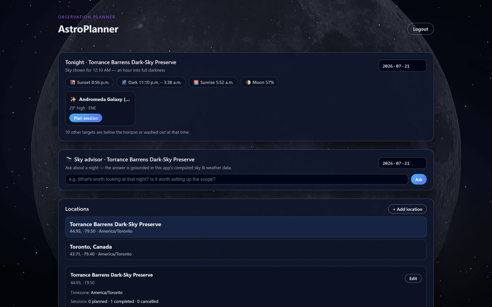
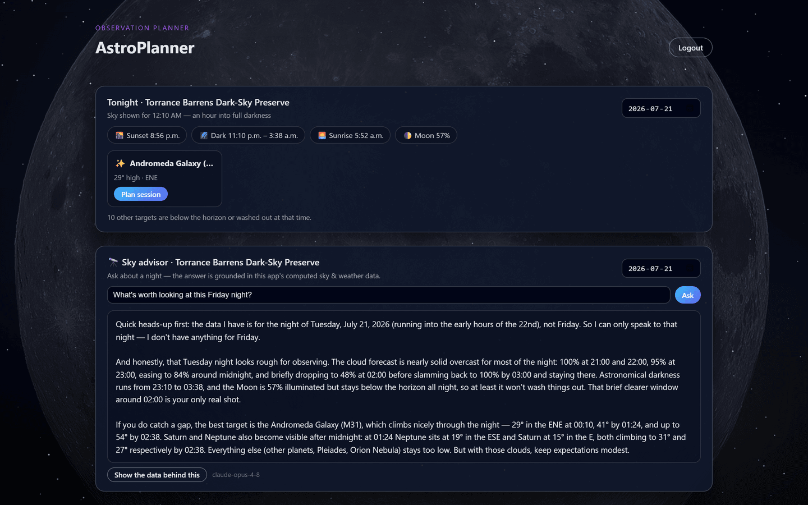
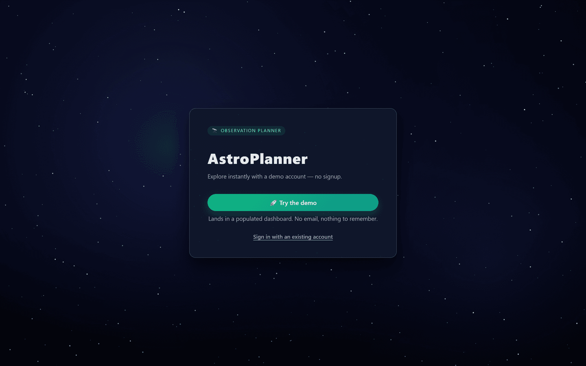

# AstroPlanner

AstroPlanner is an astronomy session planner and observing log web app. Pick an
observing location, see which planets and deep-sky objects are actually visible
from there at a given time (computed with real ephemeris data via Skyfield),
check the hourly forecast for your session, and log what you saw.



## Features

- **"Tonight at a glance"**: darkness window (sunset, astronomical twilight,
  sunrise), moon illumination, and ranked target cards for the best viewing
  time — one click prefills a planned session
- Visibility planner: altitude/azimuth, sun altitude, and elongation for the
  Moon, planets, and bright DSOs at your chosen time and place, with
  "why not visible" explanations, computed with Skyfield + the JPL DE421
  ephemeris
- **Sky advisor** (optional): ask a plain-language question ("what's worth
  looking at Friday night?") and get an answer from Claude grounded strictly
  in the app's own computed data — darkness window, moon, ranked targets, and
  the hourly cloud forecast are bundled into one JSON block the model is
  instructed to not stray from; the UI shows the answer and the data behind
  it. Feature-flagged on `ANTHROPIC_API_KEY`; the app runs normally without it
- Saved observing locations with geocoding autofill (name → coordinates + timezone)
- Session planning in the location's local timezone (stored as UTC)
- Hourly weather forecast for each planned session (Open-Meteo, humanized
  WMO conditions)
- Observation logs per session: notes, tap-once seeing/transparency quality,
  star ratings
- Export planned sessions as an `.ics` calendar file
- User accounts with JWT auth (case-insensitive emails, friendly API errors)
- **Demo mode**: a one-click "Try the demo" button mints an ephemeral,
  pre-seeded account so visitors land straight in a populated dashboard — with
  public registration disabled by design on the hosted deploy (see below)
- Ambient space backdrop: a procedural canvas starfield (parallax drift,
  twinkle, shooting stars) over a NASA/ESA photo of whatever target you're
  planning — ~4 MB of assets total, honors `prefers-reduced-motion`

## Screenshots

The Sky advisor turning a night's computed data into a plan. Every figure it
quotes — cloud cover, the darkness window, moonset, each target's altitude and
bearing — comes from the app's own calculations, not the model's memory:



| Landing (demo deployment) | Tonight at a glance |
|---|---|
|  |  |

## Tech stack

| Layer     | Tech |
|-----------|------|
| Backend   | FastAPI, SQLAlchemy, Pydantic v2, Skyfield (JPL DE421 ephemeris) |
| Database  | SQLite for local dev, PostgreSQL in Docker |
| Frontend  | React 19 + TypeScript, Vite |
| Deploy    | Docker Compose: nginx (static frontend + API reverse proxy) → FastAPI → Postgres |
| External  | Open-Meteo forecast + geocoding APIs |

## Local development

Backend (Python 3.12+):

```bash
cd backend
python -m venv .venv && .venv/Scripts/activate   # or source .venv/bin/activate
pip install -r requirements.txt
cp .env.example .env    # then set SECRET_KEY (see comment in the file)
uvicorn app.main:app --reload
```

Frontend:

```bash
cd frontend
npm install
npm run dev             # http://localhost:5173, API at http://127.0.0.1:8000
```

API docs are served at `http://127.0.0.1:8000/docs`.

Run the backend tests:

```bash
cd backend
python -m pytest tests/
```

## Docker deployment

```bash
cp .env.example .env    # set SECRET_KEY and POSTGRES_PASSWORD
docker compose up --build
```

Then open `http://localhost:8081`. nginx serves the built frontend, proxies
`/api/*` to the FastAPI container (same origin, no CORS in production), and
Postgres data persists in the `pgdata` volume. The frontend port is bound to
loopback only — in production the public entrance is Caddy (below).


## Configuration

| Variable | Where | Notes |
|----------|-------|-------|
| `SECRET_KEY` | required | JWT signing key; app refuses to start without it |
| `DATABASE_URL` | optional | defaults to local SQLite; compose sets Postgres |
| `CORS_ORIGINS` | optional | comma-separated origins for dev; unused same-origin |
| `ACCESS_TOKEN_EXPIRE_MINUTES` | optional | JWT lifetime, default 60 |
| `ANTHROPIC_API_KEY` | optional | enables the Sky advisor; unset = feature hidden |
| `ADVISOR_MODEL` | optional | Claude model for the advisor, default `claude-opus-4-8` |
| `DOMAIN` | prod only | public hostname for Caddy/Let's Encrypt |
| `DEMO_MODE` | optional | exposes `POST /demo/start` (ephemeral seeded accounts), default off |
| `ALLOW_REGISTRATION` | optional | `false` disables public signup (`/auth/register` → 403), default on |
| `DEMO_USER_TTL_HOURS` | optional | age at which demo accounts are purged, default 24 |
| `RATE_LIMIT_*` | optional | override the login/register/advisor/demo limits |

## Roadmap

- Alembic migrations (schema is currently `create_all` on startup — a
  pre-existing SQLite dev database needs a manual `ALTER TABLE` after a
  model change until this lands)
- More DSO targets and a proper catalog search

Background image credits: `frontend/src/assets/backgrounds/ATTRIBUTION.md`.
