# AstroPlanner

[](https://github.com/days-hub/astroplanner/actions/workflows/ci.yml)

**Live demo: [bortle.app](https://bortle.app)** — no signup required; click
"Try the demo" for a seeded sandbox.

AstroPlanner is an astronomy session planner and observing log web app. Pick an
observing location, see which planets and deep-sky objects are actually visible
from there at a given time (computed with real ephemeris data via Skyfield),
check the hourly forecast for your session, and log what you saw.

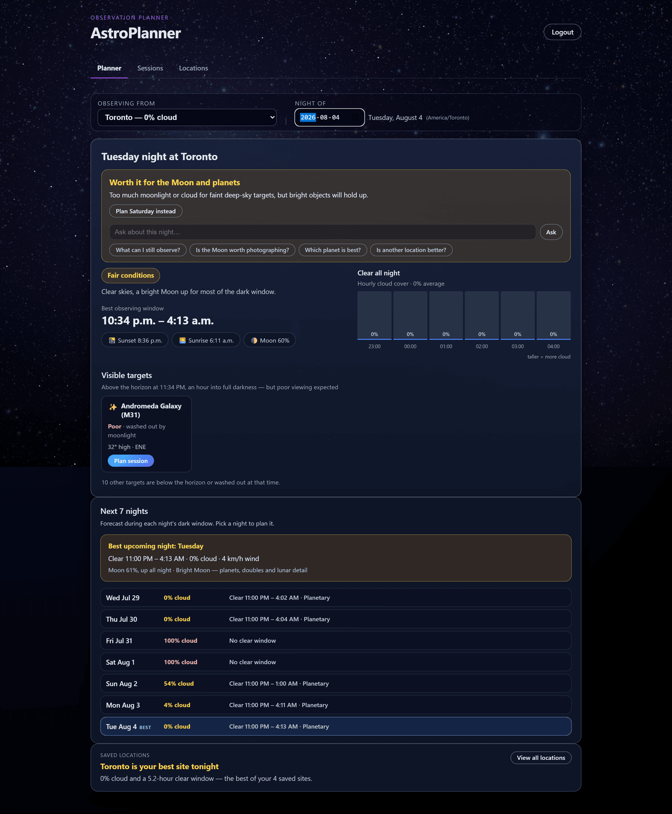

## Features

- **"Tonight at a glance"**: darkness window (sunset, astronomical twilight,
  sunrise), moon illumination, and ranked target cards for the best viewing
  time — one click prefills a planned session
- Visibility planner: altitude/azimuth, sun altitude, and elongation for the
  Moon, planets, and bright DSOs at your chosen time and place, with
  "why not visible" explanations, computed with Skyfield + the JPL DE421
  ephemeris
- **Sky advisor** (optional): ask a plain-language question ("what's worth
  looking at Friday night?") and get an answer from Claude grounded strictly
  in the app's own computed data — darkness window, moon, ranked targets, and
  the hourly cloud forecast are bundled into one JSON block the model is
  instructed to not stray from; the UI shows the answer and the data behind
  it. Feature-flagged on `ANTHROPIC_API_KEY`; the app runs normally without it
- **Search-first locations**: add a site by name, not by coordinates. Results
  are ranked toward wherever you're currently planning, and a query the
  geocoder can't match verbatim ("Sydney Australia") falls back to fewer words
  and says which query it actually answered. Each saved site shows its
  forecast for the selected night and, when that night is a write-off, when
  it's next usable
- **Seven-night outlook** and an automatic best-site recommendation. Sites are
  scored on sky alone — cloud, clear-window length, moonlight weighted by how
  much of the dark window the Moon is up, and wind — so the ranking is the
  same regardless of which site you're asking from; distance is applied
  separately as a threshold a site must clear before it's worth driving to
- Session planning in the location's local timezone (stored as UTC)
- Hourly weather forecast for each planned session (Open-Meteo, humanized
  WMO conditions)
- Observation logs per session: notes, tap-once seeing/transparency quality,
  star ratings
- Export planned sessions as an `.ics` calendar file
- User accounts with JWT auth (case-insensitive emails, friendly API errors)
- **Demo mode**: a one-click "Try the demo" button mints an ephemeral,
  pre-seeded account so visitors land straight in a populated dashboard — with
  public registration disabled by design on the hosted deploy, so no stranger
  PII is stored
- Ambient space backdrop: a procedural canvas starfield (parallax drift,
  twinkle, shooting stars) over a NASA/ESA photo of whatever target you're
  planning — ~4 MB of assets total, honors `prefers-reduced-motion`

## Screenshots

### Planner

The night's verdict comes first, and you can question it without leaving the
card. The title names the night you're looking at, so changing the date never
leaves you reading yesterday's answer:

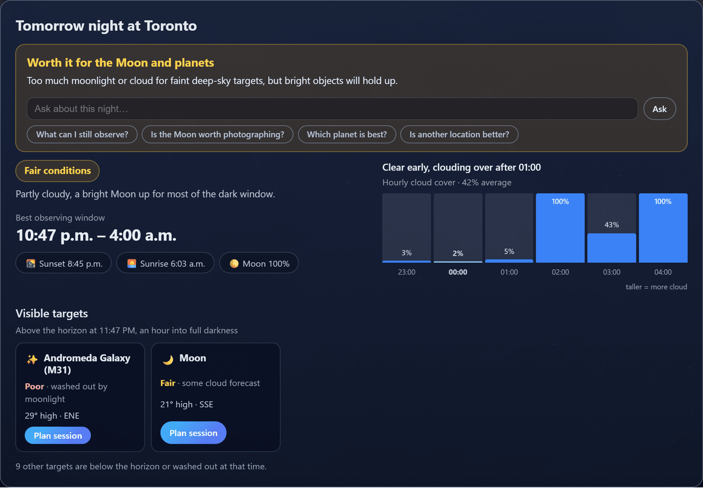

The Sky advisor turning that same computed data into a plan. Every figure it
quotes — cloud cover, the darkness window, moon phase, each target's altitude
and bearing — comes from the app's own calculations, not the model's memory:

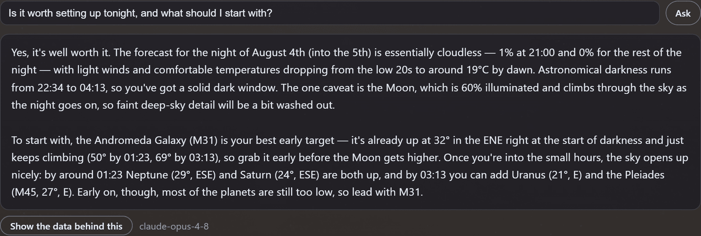

…and it shows its work. "Show the data behind this" reveals the exact JSON
block the model was given, so any claim in the answer can be checked against
the numbers it came from:

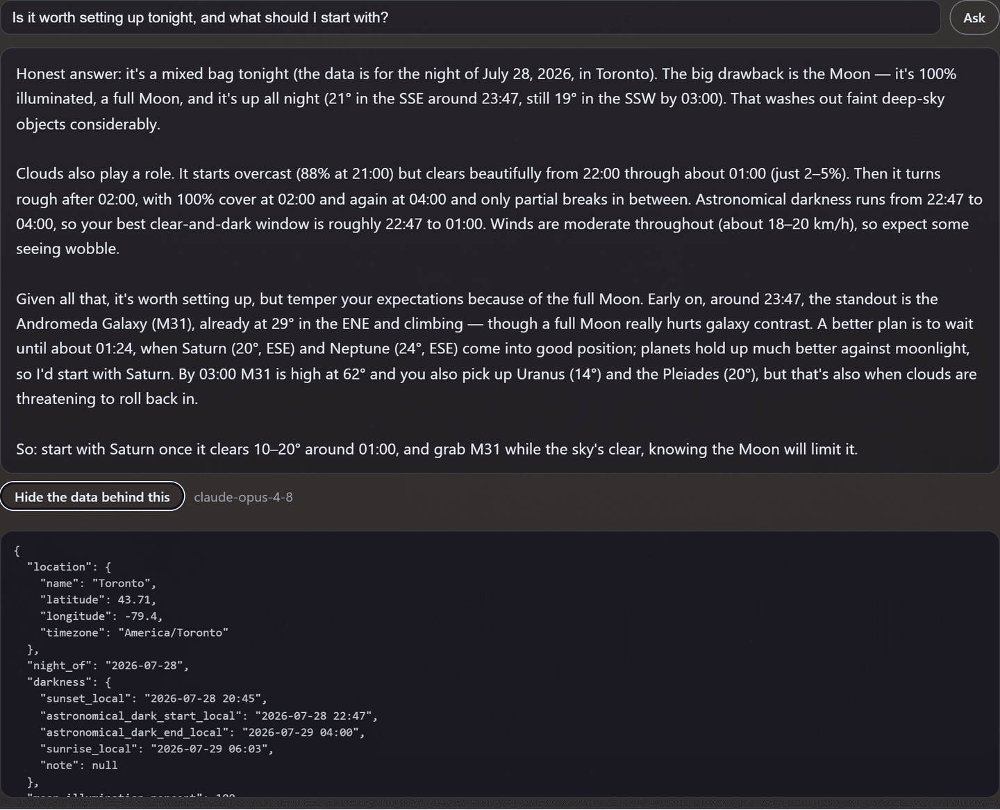

The one-tap questions follow the forecast rather than sitting static — a
bright-Moon night offers different questions than a clouded-out one:

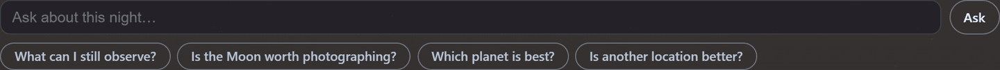

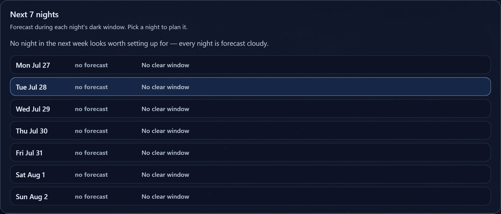

Nights are ranked by the same scorer used for sites, so the outlook and the
location comparison can't disagree about what "better" means: cloud,
clear-window length, moonlight weighted by how much of the dark window the
Moon is actually up, and wind.

That scoring deliberately knows nothing about where you're standing, so the
ranking is identical whichever site you ask from. Distance enters separately,
as a bar a site has to clear before it's worth driving to — which gives the
recommendation two distinct things to say:

| Your site is the best one | Somewhere is clearer, but not worth the drive |
|---|---|
| 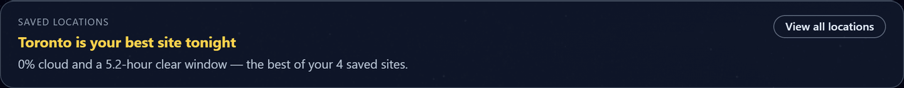 | 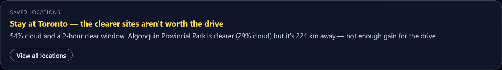 |

Both name their numbers. A recommendation you can't check is one you won't
trust — especially when it's asking you to drive 200 km.

### Sessions

Grouped into what's still ahead and what already happened, filterable by
status. A completed night carries its forecast and observation log side by
side:

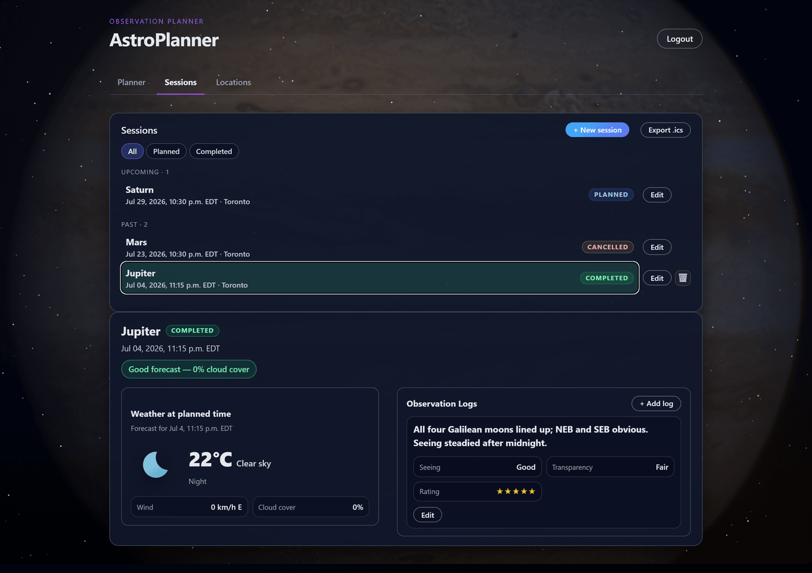

| Session list | Observation log |
|---|---|
| 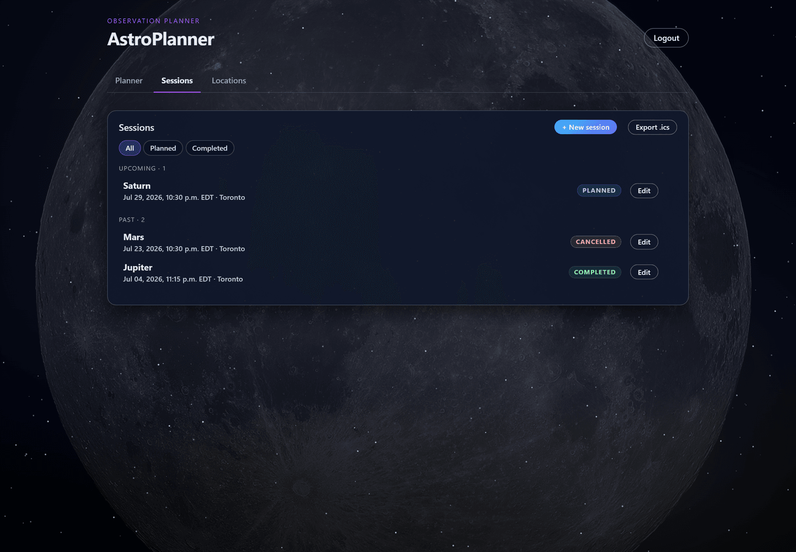 | 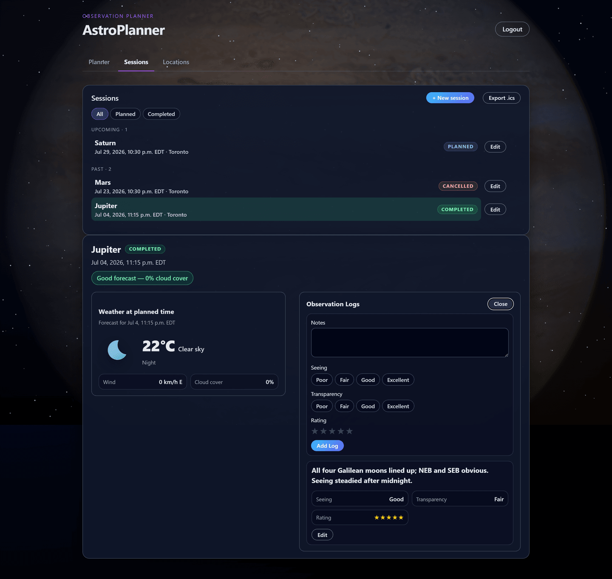 |

Planning happens in a drawer over the list rather than on its own route —
creating a session is an action, not a destination. Targets are filtered to
what's actually above the horizon at the chosen time, with the reason given
for anything that isn't:

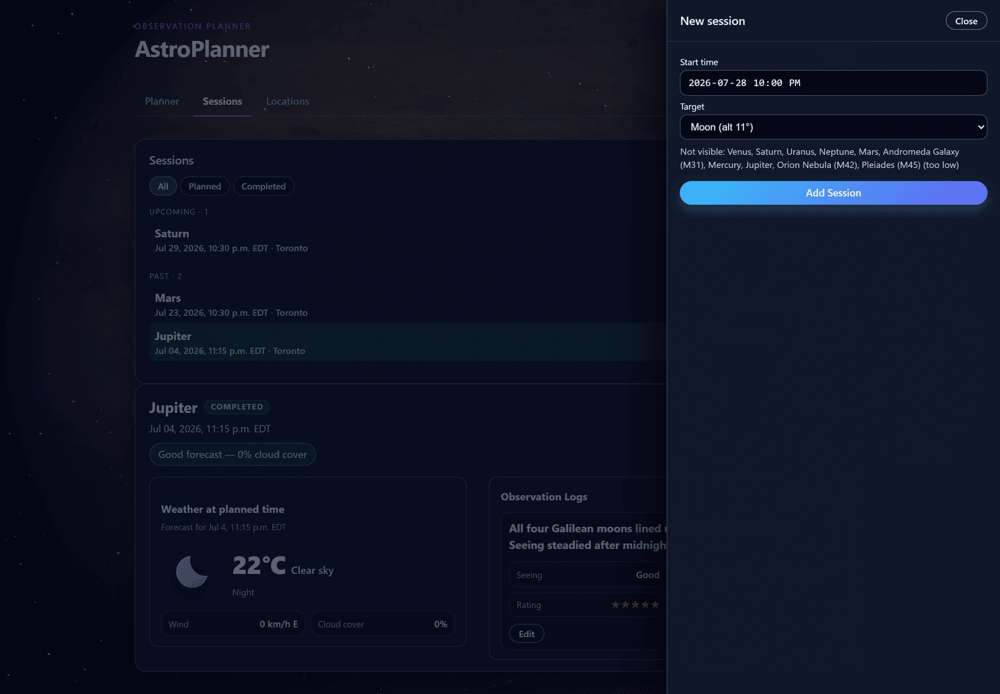

### Locations

Each saved site answers where it is, how it looks on the selected night, and
when it's next usable — coordinates and timezone sit behind Edit, because
nobody chooses an observing site by reading decimals:

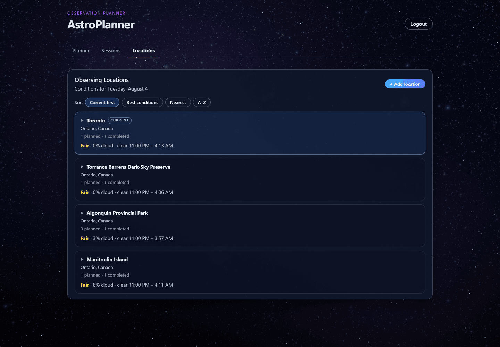

| Adding a site | Landing (demo deployment) |
|---|---|
| 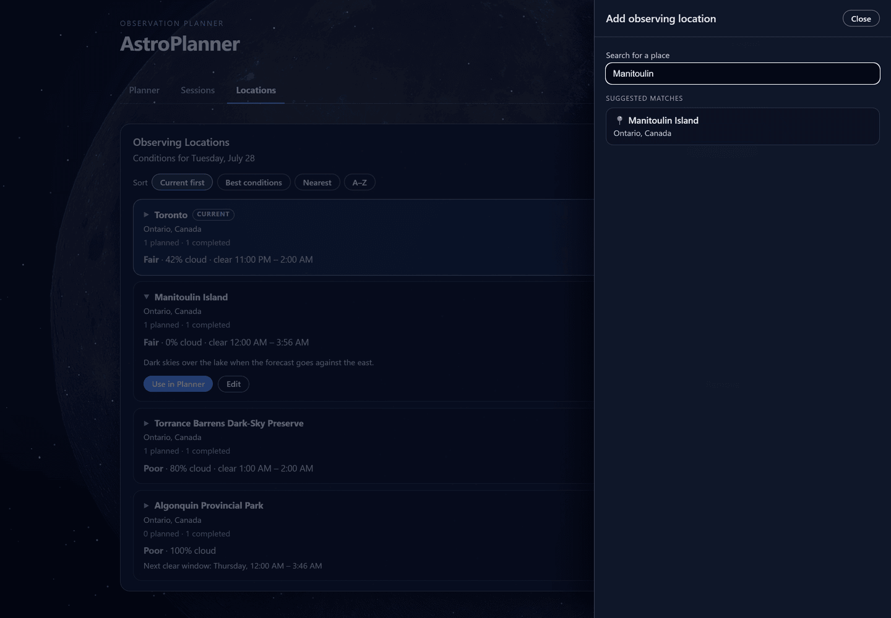 | 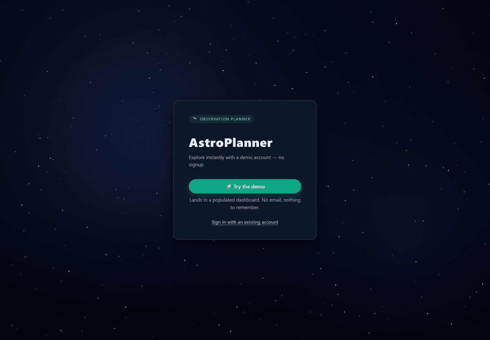 |

Locations are added by searching, not by typing coordinates. Results are
ranked toward wherever you're currently planning, and if the full query finds
nothing the search falls back to fewer words and says so rather than silently
answering a narrower question.

## Tech stack

| Layer     | Tech |
|-----------|------|
| Backend   | FastAPI, SQLAlchemy, Pydantic v2, Skyfield (JPL DE421 ephemeris) |
| Database  | SQLite for local dev, PostgreSQL in Docker |
| Frontend  | React 19 + TypeScript, Vite |
| Deploy    | Docker Compose: nginx (static frontend + API reverse proxy) → FastAPI → Postgres |
| External  | Open-Meteo forecast + geocoding APIs |

## Local development

Backend (Python 3.12+):

```bash
cd backend
python -m venv .venv && .venv/Scripts/activate   # or source .venv/bin/activate
pip install -r requirements.txt
cp .env.example .env    # then set SECRET_KEY (see comment in the file)
uvicorn app.main:app --reload
```

Frontend:

```bash
cd frontend
npm install
npm run dev             # http://localhost:5173, API at http://127.0.0.1:8000
```

API docs are served at `http://127.0.0.1:8000/docs`.

Run the backend tests:

```bash
cd backend
python -m pytest tests/
```

## Docker deployment

```bash
cp .env.example .env    # set SECRET_KEY and POSTGRES_PASSWORD
docker compose up --build
```

Then open `http://localhost:8081`. nginx serves the built frontend, proxies
`/api/*` to the FastAPI container (same origin, no CORS in production), and
Postgres data persists in the `pgdata` volume. The frontend port is bound to
loopback only; the production overlay (`docker-compose.prod.yml`) puts Caddy in
front of it for automatic TLS.

## Configuration

| Variable | Where | Notes |
|----------|-------|-------|
| `SECRET_KEY` | required | JWT signing key; app refuses to start without it |
| `DATABASE_URL` | optional | defaults to local SQLite; compose sets Postgres |
| `CORS_ORIGINS` | optional | comma-separated origins for dev; unused same-origin |
| `ACCESS_TOKEN_EXPIRE_MINUTES` | optional | JWT lifetime, default 60 |
| `ANTHROPIC_API_KEY` | optional | enables the Sky advisor; unset = feature hidden |
| `ADVISOR_MODEL` | optional | Claude model for the advisor, default `claude-opus-4-8` |
| `DOMAIN` | prod only | public hostname for Caddy/Let's Encrypt |
| `DEMO_MODE` | optional | exposes `POST /demo/start` (ephemeral seeded accounts), default off |
| `ALLOW_REGISTRATION` | optional | `false` disables public signup (`/auth/register` → 403), default on |
| `DEMO_USER_TTL_HOURS` | optional | age at which demo accounts are purged, default 24 |
| `RATE_LIMIT_*` | optional | override the login/register/advisor/demo limits |

## Database migrations

Schema changes run through Alembic, applied automatically at startup
(`app/db/migrations.py`). Databases created before Alembic was introduced are
detected and stamped at the baseline rather than colliding with it, so
upgrading an existing deployment needs no manual step.

After changing a model:

```bash
cd backend
alembic revision --autogenerate -m "what changed"   # review the generated file
alembic upgrade head                                # or just restart the app
```

`tests/test_migrations.py` fails if the models and migrations drift apart, so
a forgotten migration is caught in CI rather than at deploy time. This
replaced `Base.metadata.create_all()`, which created missing *tables* but
never altered existing ones — adding a column left every already-deployed
database silently behind.

## Roadmap

- More DSO targets and a proper catalog search
- Password reset flow (public deploys run demo-only, so no stranger accounts
  depend on it today)

Background image credits: `frontend/src/assets/backgrounds/ATTRIBUTION.md`.
